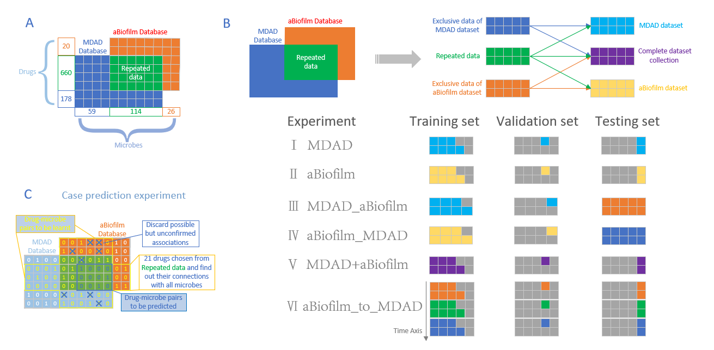

# Predicting drug-microbe associations using a signature fusion learning network | [Paper](https://doi.org/10.1038/s42256-022-00605-1)

## Introduction
This repository contains the PyTorch implementation of **MiDSFN** framework, as described in our *Nature Computational Science* paper "[Predicting drug-microbe associations using a signature fusion learning network](https://doi.org/)".  **MiDSFN** is a deep feature fusion network framework to explicitly learn pair-wise local interactions between drugs and microbes.
It works on two-dimensional (2D) drug molecular graphs and microbe coding sequences to perform prediction.

## Contexts
1. The vast majority of existing drug-microbe association prediction models intentionally or unintentionally use the original drug-microbe association adjacency matrix A in their input structure, a process that is feared to have occurred as a data leakage；
2. Their input relies on a very small number of drug-microbe association pairs, and on such frameworks we will have difficulty in truly realizing real-world demands for diverse and complex drug-microbe association learning understanding and prediction; 
3. We have spent two years on this, trying to provide a new way of thinking about these problems, where the inputs to the model all use features of the drugs and microbes themselves (rather than features transformed by the adjacency matrix A and given names), to enable interaction learning down to the level of each drug-microbe pair.

(Removal or retention of this section will be subject to editorial or review comments).

## Framework


## System Requirements
The source code developed in Python 3.7 using PyTorch 1.13.1. The required python dependencies are given below. MiDSFN is supported for any standard computer and operating system (Windows/macOS/Linux) with enough RAM to run. There is no additional non-standard hardware requirements.

```
torch>=1.13.1
dgl>=0.7.1
dgllife>=0.2.8
numpy>=1.20.2
scikit-learn>=0.24.2
pandas>=1.2.4
prettytable>=2.2.1
typing>=4.4.0
rdkit~=2021.03.2
yacs~=0.1.8
comet-ml~=3.23.1 # optional
```
And additional packages needed if you want to see how our study goes.
```
csv
random
openpyxl
rdkit
PIL
sklearn
scipy
matplotlib
seaborn
```

## Installation Guide
Clone this Github repo and set up a new conda environment. It normally takes about 10 minutes to install on a normal desktop computer.
```
# create a new conda environment
$ conda create --name MiDSFN python=3.7
$ conda activate MiDSFN 

# install requried python dependencies
$ conda install pytorch==1.13.1 torchvision==0.8.2 torchaudio==0.7.2 cudatoolkit=10.2 -c pytorch
$ conda install -c dglteam dgl-cuda10.2==0.7.1
$ conda install -c conda-forge rdkit==2021.03.2
$ pip install dgllife==0.2.8
$ pip install -U scikit-learn
$ pip install yacs
$ pip install prettytable
$ pip install typing
$ pip install openpyxl
$ pip install rdkit
$ pip install pillow
$ pip install scipy
$ pip install matplotlib
$ pip install seaborn

```

## Datasets
The `source_dealed_data` folder contains MDAD and aBiofilm datasets and correlated information we select in [gcType](https://gctype.wdcm.org/) [Microbial high quality 16s rDNA gene strips] and [PubChem](https://pubchem.ncbi.nlm.nih.gov/) [Drug 1D CanonicalSMILES].

The `datasets` folder contains some experimental data extract from used in MiDSFN, we can also randomly generate new data corresponding to the experiment by running the code `experiment…….py`. In which these codes grab data from `source_dealed_data` according to the requirements of the paper. We should run this code before running the main code for training the model to generate the corresponding training data, which is saved in the corresponding folders train.csv (training set), val.csv (validation set) and test.csv (test set).


The `new_probably_connections(Fuzzy_set)` folder contains the probably connections searched using the code in file MDAD and aBiofilm datasets. The code run date is from 2024/9/23 to 2024/10/1, if some new connections are needed, it is better to use the code to search again as far as we need to search, as there will be a handful of new articles over time. And the articles are all from [PubMed](https://pubmed.ncbi.nlm.nih.gov/) [A resource can search for biomedical papers and abstracts, free searchable databases], just type in the corresponding PMID to find the article.
/Searching_connections.png)

## Demo
The **expected output and run time** of demo has been provided in the colab notebook for verification.


## Run MiDSFN on Our Data to Reproduce Results

To train MiDSFN, where we provide the basic configurations for all hyperparameters in `config.py`. For key parameters and experimental setups, the customized task configurations can be found in respective `configs/MiDSFN.yaml` files, and these settings override those in `config.py`.

For different data input experiments with vanilla MiDSFN, you can directly run the following command. `${split_task}` could be `MDAD`, `aBiofilm`, `MDAD_aBiofilm`, `aBiofilm_MDAD`, `MDAD+aBiofilm`, `aBiofilm_to_MDAD`, `MDAD_aBiofilm_discard`, `MDAD+aBiofilm_discard`, `Case_prediction`, `Ethnic_interaction`. As another reminder, the corresponding section in the `datasets` folder has already generated the experimental data.
```
$ python main.py --cfg "configs/MiDSFN.yaml" --data "drug_microbe" --split ${split_task}
```

## Data process and studies in article did

All program code files such as `experiment…….py` are the data process programs to process data in `source_dealed_data` and save dealed data for experiment in `datasets`.

All program code files such as `model_invoke_…….py` are the check programs for the trained models in folder `result`, they have different functions. And set the command following annotations in corresponding code. And pay attention to the path of the optimal model file read in the code, each computer may run a different optimal model round (it could be any integer between 1-20), we need to change the code to read the path of the statement, which is next to the note `#This place need to be confirm every time.`.

## Comet ML
[Comet ML](https://www.comet.com/site/) is an online machine learning experimentation platform, which help researchers to track and monitor their ML experiments. We provide Comet ML support to easily monitor training process in our code.
This is **optional to use**. If you want to apply, please follow:

- Sign up [Comet](https://www.comet.com/site/) account and install its package using `pip3 install comet_ml`. 
   
- Save your generated API key into `.comet.config` in your home directory, which can be found in your account setting. The saved file format is as follows:

```
[comet]
api_key=YOUR-API-KEY
```

- Set `_C.COMET.USE` to `True` and change `_C.COMET.WORKSPACE` in `config.py` into the one that you created on Comet.

For more details, please refer the [official documentation](https://www.comet.com/docs/python-sdk/advanced/).

Further, if we want to check parameters trained in the final model, some code annotations such as `#np.savetxt(……`, we can dislodge the `#` character when evaluating.

## Acknowledgements
This implementation is inspired and partially based on earlier works [1].

## Citation
Please cite our [paper](https://) if you find our work useful in your own research.
```
    @article{bai2023drugban,
      title   = {},
      author  = {},
      journal = {},
      year    = {},
      publisher={},
      doi     = {}
    }
```

## References
    [1] Bai P, Miljković F, John B, Lu H. Interpretable bilinear attention network with domain adaptation improves drug-target prediction. Nat Mach Intell 2, 134-140 (2023).

