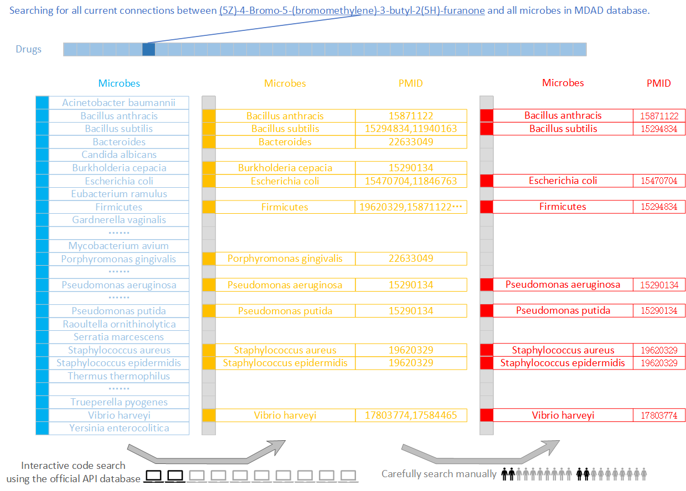

## Acknowledgements
The fuzzy set: all data using official API database ([PubMed](https://pubmed.ncbi.nlm.nih.gov/)) is saved in `connections.xlsx`.And `connections0.xlsx` contains the data we confirm manually in this experiment. 

Searching time: 2024/9/23 to 2024/10/1.

## Framework

